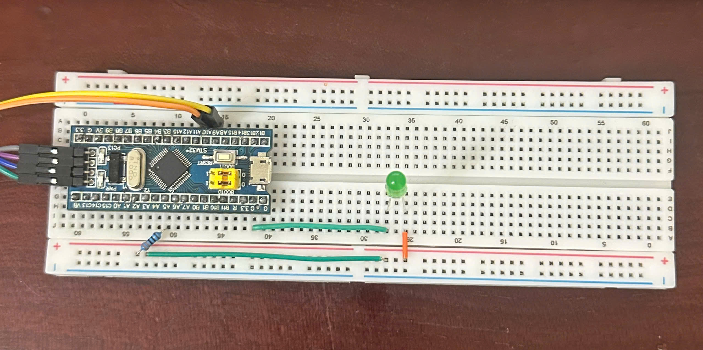

# Cấu hình UART trên STM32F1. Phản hồi ký tự và điều khiển LED bằng chuỗi từ máy tính  
---
## Mục đích  
Bài thực hành giúp chúng ta làm quen với việc **giao tiếp hai chiều qua UART** giữa STM32F1 và máy tính.  
Thông qua ví dụ, chúng ta sẽ:  

- Hiểu cách STM32 nhận dữ liệu UART từ máy tính và phản hồi trở lại.  
- Nắm được cơ chế echo (gửi lại chính ký tự vừa nhận).  
- Ứng dụng chuỗi lệnh `"ON"` / `"OFF"` để điều khiển LED ngoài.  
- Thực hành với phần mềm terminal (Hercules) để kiểm tra kết quả.  

---

## Ý tưởng  
- Sử dụng **USART1** trên STM32F103 với 2 chân: PA9 (TX) và PA10 (RX).  
- Khi máy tính gửi 1 ký tự bất kỳ → STM32 đọc và gửi trả lại(echo).  
- Nếu máy tính gửi chuỗi `"ON"` → STM32 bật LED.  
- Nếu máy tính gửi chuỗi `"OFF"` → STM32 tắt LED.  
- LED kết nối với chân GPIO ở chế độ Output.  

---

## Cấu hình  
- Bật clock cho **GPIOA**, **AFIO**, và **USART1**.  
- Thiết lập:  
  - **PA9 (TX)** ở chế độ Alternate Function Push-Pull, tốc độ 50 MHz.  
  - **PA10 (RX)** ở chế độ Input Floating.  
  - **PA5** (LED) ở chế độ Output Push-Pull.  
- USART1:  
  - Baudrate: **9600 bps**  
  - Word length: **8 bits**  
  - Stop bit: **1**  
  - Parity: **None**  
  - Mode: **Tx / Rx**  
- Cơ chế hoạt động dựa trên **ngắt UART (USART1_IRQHandler)**:  
  - Mỗi ký tự nhận được lưu vào mảng data.  
  - Khi gặp ký tự xuống dòng `\n` hoặc `\r`, chương trình so sánh chuỗi với `"ON"` hoặc `"OFF"`.  
  - Kết quả quyết định trạng thái LED.

---

## Phần cứng kết nối  
- **STM32F103C8T6**.  
- **CP2102 (USB–UART)**.  
- **Kết nối:**  
  - PA9 (TX) → RX module UART  
  - PA10 (RX) → TX module UART  
  - GND STM32 ↔ GND UART  
- **LED**:  
  - PA5 → Điện trở 220Ω → Anode LED  
  - GND → Cathode LED 
  
---

**Source code:** [Bài 5.2](RQ2_lib.c)  

**Video Demo:** [Demo 5.2](https://drive.google.com/drive/u/0/folders/1Oe8JzTGrgc85HJdUix4PGqNyrMWjyYAS)  
